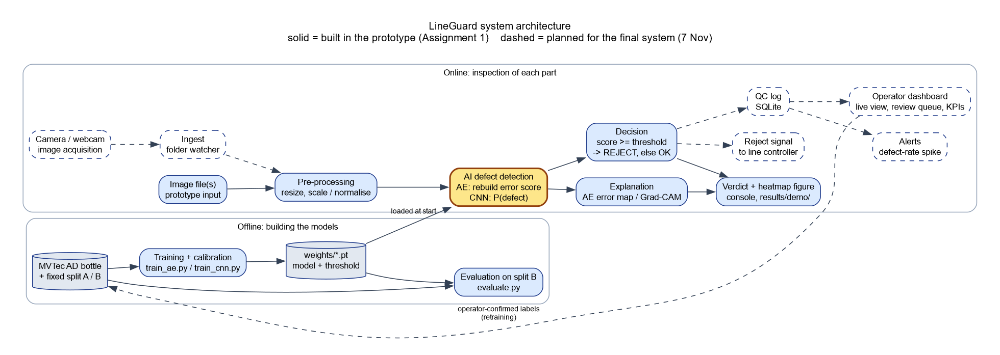

# LineGuard: inputs for the Assignment 1 report

For the documentation team. Facts, numbers and tables only; the report wording is yours.
Every result here comes from `results/SUMMARY.md`; if the two ever disagree, `SUMMARY.md` wins.
Status: 2026-10-02, prototype complete, tag `v0.1-assignment`.

## 0. Where to find what, per marking criterion

| Report part (marking criterion) | Source |
|---|---|
| Title, product description | §1 below |
| System overview, sub-systems, workflow (requirements & specs, 30–35%) | §2, §3, `architecture.png` |
| Data and knowledge needed | §4 |
| AI technique comparison and justification (20%) | §5, §6, `results/SUMMARY.md`, `results/*.png` |
| Test plan (part of the 30–35%) | §7 |
| Prototype: code, initial results, steps to run (15–20%) | `README.md` §1–2, §6 here, `results/` |
| Plan and milestones | §8 |
| Tools: PM, version control, collaboration, communication (no mark without them) | §9 (two rows for the team to fill) |
| References | `README.md` §6 |
| Appendix: AI prompts | `docs/ai_prompts.md` + the team's claude.ai planning prompts |
| Interview preparation | `docs/walkthrough.md` |

## 1. Product

| Item | Value |
|---|---|
| Name | LineGuard |
| What it does | Scores a photo of a manufactured part, decides OK or REJECT, shows a heatmap of where the defect is |
| Prototype scope | One AI sub-system (defect detection), two techniques compared on the same held-out images |
| Product inspected in the prototype | Glass bottles (MVTec AD `bottle`): top view, defect types broken_large, broken_small, contamination |
| Code | Private GitHub repo https://github.com/DhruvGoswami10/lineguard (private for academic integrity: the marker gets the zip; the tutor can be invited by GitHub username) |

## 2. System architecture



`docs/architecture.png` (source: `docs/architecture.dot`, Graphviz). Solid = built now, dashed = final system.

| # | Sub-system | AI? | Input | Output | Status | Code |
|---|---|---|---|---|---|---|
| 1 | Image acquisition (camera / webcam) | No | Part on the line | Image file | Final | — |
| 2 | Ingest (folder watcher) | No | New image files | Image queue | Final | — |
| 3 | Pre-processing | No | Image (any size, RGB) | Tensor: 128×128 in [0,1] (AE) or 224×224 ImageNet-normalised (CNN) | **Built** | `src/data.py` |
| 4 | AI defect detection | **Yes** | Pre-processed tensor | Anomaly score (AE) or P(defect) (CNN) | **Built** | `src/models.py`, `src/inference.py` |
| 5 | Decision | No | Score + threshold | OK / REJECT (REJECT if score ≥ threshold) | **Built** | `src/inference.py` |
| 6 | Explanation (heatmap) | Yes (Grad-CAM uses the CNN's gradients) | Image + model | Heatmap: AE error map / Grad-CAM | **Built** | `src/inference.py`, `src/gradcam.py`, `src/visualize.py` |
| 7 | Result output | No | Verdict + heatmap | Console line + figure | **Built** | `src/demo.py` |
| 8 | Reject signal | No | REJECT verdict | Signal to line controller (simulated) | Final | — |
| 9 | QC log | No | Every verdict + score | SQLite database | Final | — |
| 10 | Operator dashboard | No | QC log | Live view, review queue, yield / defect-rate KPIs | Final | — |
| 11 | Alerts | No (rules) | QC log | Alert when defect rate spikes | Final | — |
| 12 | Training + calibration (offline) | **Yes** | Dataset + split | `weights/*.pt` (model + threshold) | **Built** | `src/train_ae.py`, `src/train_cnn.py` |
| 13 | Evaluation (offline) | No | Weights + split B | Metrics, plots, `SUMMARY.md` | **Built** | `src/evaluate.py` |

## 3. Workflow of one inspection (prototype)

1. An image file is given to the demo (`python -m src.demo --model ae --input <file or folder>`).
2. Pre-processing resizes it (128×128 for the AE, 224×224 + ImageNet normalisation for the CNN).
3. The model scores it: AE = highest smoothed rebuild error; CNN = softmax probability of "defect".
4. Decision: REJECT if score ≥ threshold (AE 0.00453, chosen on split A; CNN 0.5), else OK.
5. A heatmap is made (AE error map / Grad-CAM) and saved with the verdict as a figure.
6. Final system adds: camera + ingest before step 1; reject signal, QC log, dashboard and alerts after step 4.

## 4. Data and knowledge

| Item | Value |
|---|---|
| Dataset | MVTec AD, category `bottle` (Bergmann et al., 2019; 2021) |
| Licence | CC BY-NC-SA 4.0, copyright 2019 MVTec Software GmbH (non-commercial use allowed) |
| Images | 900×900 RGB PNG, top view of a glass bottle |
| Defect-free training images | 209 (`train/good`) |
| Test images | 83: good 20, broken_large 20, broken_small 22, contamination 21 |
| Ground truth | Image label = folder name; pixel masks for all 63 defect images |
| Download | `python -m src.download_data`: Hugging Face mirror pinned to one commit, SHA-256 checked |

| Part | Images | Used for |
|---|---|---|
| train | 188 good | AE training; CNN training |
| val | 21 good | AE early stopping; CNN monitoring only |
| split A | 41 (10 good, 31 defect) | CNN training; AE threshold only |
| split B | 42 (10 good, 32 defect) | Evaluation of both models, nothing else |

Split rule: `test/` split 50/50 within each folder (stratified), seed 42; 10% of `train/good` held out
for validation. Saved once in `splits/bottle_split.json`; a unit test proves it is rebuilt exactly from the seed.

Pre-processing per technique:

| Step | Autoencoder | ResNet-18 |
|---|---|---|
| Resize | 128×128 | 224×224 |
| Scaling | pixels to [0, 1] (matches the sigmoid output) | ImageNet mean/std normalisation (matches pretrained weights) |
| Augmentation (training only) | none | horizontal + vertical flip, rotation ±15°, colour jitter 0.1 |
| Post-processing | per-pixel squared error, mean over RGB, Gaussian blur σ = 4 px, score = max | softmax, score = P(defect) |

## 5. The two techniques

| | Technique 1: convolutional autoencoder | Technique 2: ResNet-18 classifier |
|---|---|---|
| Learning type | Unsupervised (anomaly detection) | Supervised (classification), transfer learning |
| Trained on | 188 good images only | 198 good + 31 defect images |
| Defect images needed for training | **0** | 31 |
| Labelled images used to set the threshold | 41 (split A: 10 good, 31 defect) | none (fixed 0.5) |
| Architecture | 4 stride-2 conv blocks (32, 64, 128, 64 channels) → 8×8×64 code → mirrored transposed convs, sigmoid | ResNet-18, ImageNet weights, final layer replaced with 2 outputs |
| Parameters | 594,435 | 11,177,538 |
| Weights file | 2.4 MB | 44.8 MB |
| Loss | MSE (rebuild error) | Class-weighted cross-entropy (good 0.578, defect 3.694) |
| Optimiser | Adam, lr 1e-3, batch 16 | Adam, lr 1e-4, batch 16 |
| Epochs | up to 100, early stopping (patience 10) on validation loss; kept epoch 100 | 20 (fixed) |
| Score | max of smoothed rebuild-error map | softmax P(defect) |
| Threshold | 0.00453 = best F1 on split A (split-A F1 0.933), placed halfway between neighbouring scores, computed on CPU | 0.5 (split A is its training data) |
| Heatmap | rebuild-error map (pixel level) | Grad-CAM on layer4 (7×7 grid, upsampled), hand-written with hooks |
| Training time (development laptop) | GPU 22 s; CPU about 4 min (estimated) | GPU 2.5 min; CPU about 7 min (estimated) |

## 6. Initial results (split B, 42 held-out images, CPU)

| Metric | Autoencoder | ResNet-18 |
|---|---|---|
| Image AUROC [95% CI] | 0.928 [0.837–0.990] | 0.988 [0.956–1.000] |
| Precision [95% CI] | 0.933 [0.779–0.992] | 1.000 [0.888–1.000] |
| Recall [95% CI] | 0.875 [0.710–0.965] | 0.969 [0.838–0.999] |
| F1 [95% CI] | 0.903 [0.815–0.970] | 0.984 [0.949–1.000] |
| Specificity [95% CI] | 0.800 [0.444–0.975] | 1.000 [0.692–1.000] |
| TP / FN / FP / TN | 28 / 4 / 2 / 8 | 31 / 1 / 0 / 10 |
| Recall broken_large / broken_small / contamination | 100% / 100% / 64% | 100% / 100% / 91% |
| CPU ms per image | ~7 | ~21 |
| Pixel AUROC (localisation) | 0.895 | n/a |

CPU = AMD Ryzen 9 7940HS laptop. 95% CI = exact binomial (Clopper–Pearson) interval for precision, recall
and specificity; bootstrap percentile interval (1,000 resamples of split B) for AUROC and F1.

Figures for the report (all in `results/`):

| File | Shows |
|---|---|
| `roc.png` | ROC curves of both models on split B |
| `confusion_matrices.png` | Confusion matrices side by side |
| `score_hist_ae.png`, `score_hist_cnn.png` | Score distributions, good vs defect, with the threshold |
| `ae_training_curve.png`, `cnn_training_curve.png` | Training/validation loss per epoch |
| `heatmaps/` | 6 examples per model; file name says correct-reject / correct-ok / missed-defect / false-alarm |
| `demo/` | Demo output for all 20 sample images, both models |
| `../docs/architecture.png` | System architecture |

## 7. Test plan and results

Automated unit tests: `python -m unittest discover -s tests -v` (51 tests). Result on 2026-10-02: **51 / 51 pass**,
also in fresh installs on Python 3.12 and 3.13 (CPU only).

| ID | Sub-system | Test | Method | Pass criterion | Result |
|---|---|---|---|---|---|
| T1 | Data | Layout check catches missing folders, masks and dataset | Unit (`test_data.py`, fake dataset) | Error raised with fix hint | Pass |
| T2 | Data | Split sizes and stratification | Unit | train 188, val 21, A 41, B 42; per-folder halves | Pass |
| T3 | Data | No image in two parts of the split | Unit | All 292 images used once | Pass |
| T4 | Data | Split reproducible from its seed | Unit | Rebuilt split == committed file | Pass |
| T5 | Data | Ground-truth masks load correctly | Unit | Good → empty mask; defect → mask pixels | Pass |
| T6 | AI detection | AE output shape/range; 8×8 bottleneck | Unit (`test_models.py`) | 3×128×128 in [0,1] | Pass |
| T7 | AI detection | ResNet-18 builds offline with 2 outputs | Unit | Shape (N, 2), no download | Pass |
| T8 | Explanation | Grad-CAM shape, range, hook clean-up | Unit | 7×7 in [0,1]; no hooks left | Pass |
| T9 | Decision | Threshold rule and best-F1 choice (threshold halfway between neighbouring scores) | Unit (hand-worked numbers) | REJECT iff score ≥ threshold; expected threshold values | Pass |
| T10 | Training | Checkpoint round trip keeps weights + threshold; safe loading | Unit | Identical outputs after reload | Pass |
| T11 | Evaluation | Metric maths: counts, precision, recall, F1, specificity, per-type recall, exact binomial intervals, bootstrap intervals | Unit (`test_evaluate.py`) | Hand-worked values for counts, rates and binomial intervals; ordering + repeatability for bootstrap intervals | Pass |
| T12 | Evaluation | Results pack complete and consistent | Unit (`test_results.py`) | SUMMARY.md = metrics.csv = per-image verdicts | Pass |
| T13 | Demo | Runs on CPU for both models, file and folder input | Unit (`test_demo.py`, runs the command) | Exit 0, figures written | Pass |
| T14 | Demo | Demo scores equal evaluation scores | Unit | Same score and verdict for all 20 samples | Pass |
| T15 | Demo | Bad input gives a clean error | Unit | Non-zero exit, no traceback | Pass |
| T16 | Whole prototype | Clean install from GitHub on Python 3.12 and 3.13, CPU only, README followed word for word | Manual release check, 2026-10-02 | Tests pass, both demos run; re-download + re-evaluate gives the same metrics | Pass (both versions; metrics identical except timing) |
| T17 | AI detection | Accuracy on held-out data | `src/evaluate.py` on split B | Proposed: AUROC ≥ 0.90 | AE 0.928, CNN 0.988 |
| T18 | AI detection | Speed | `src/evaluate.py` CPU timing | Proposed: < 100 ms/image on CPU | AE ~7 ms, CNN ~21 ms |
| T18b | Training | Reproducibility: retrain both models from scratch with seed 42 | Manual, 2026-10-02 (same GPU) | Same metrics as reported | Identical: threshold, AUROC, all TP/FN/FP/TN |
| T19 | Ingest | New files picked up once, in order | Planned (final) | — | — |
| T20 | QC log | Every verdict stored with score, time, image path | Planned (final) | — | — |
| T21 | Dashboard | Shows live verdicts, review queue, KPIs | Planned (final) | — | — |
| T22 | Alerts | Alert fires when defect rate crosses limit | Planned (final) | — | — |
| T23 | Whole system | End-to-end camera → verdict → log → dashboard | Planned (final) | — | — |
| T24 | AI detection | Robustness to lighting, rotation, blur | Planned (final) | — | — |

T17 and T18 criteria are proposals; set the final targets in the requirements section.

## 8. Engineering milestones to the final (proposal)

| Date | Milestone |
|---|---|
| 3 Oct | Assignment 1 submitted (prototype) |
| 10 Oct | Last day to change the AI system (brief: 4 weeks before the final) |
| 12 Oct | Ingest (folder watcher / webcam) + QC log (SQLite) |
| 19 Oct | Operator dashboard: live view, review queue, KPIs |
| 24 Oct | Alerts + simulated reject signal; end-to-end integration |
| 28 Oct | Full system test plan run; robustness tests; work on the weakest defect type (contamination) |
| 1 Nov | Code freeze; user guide; demo video recorded |
| 5 Nov | Slides and presentation rehearsal |
| 7 Nov | Final submission |

## 9. Tools (the brief requires all four to be reported)

| Function | Tool | Evidence |
|---|---|---|
| Version control | Git + GitHub (private repo) | https://github.com/DhruvGoswami10/lineguard — commit history, tag `v0.1-assignment` |
| Project management | GitHub Issues + Milestones | Issues #1–#10 under milestone "Assignment 1 - prototype" (closed by commits) |
| Collaboration | GitHub (shared repo) + **TEAM TO FILL** (shared document tool used for the report) | Screenshots |
| Communication | **TEAM TO FILL** (e.g. the group chat / meeting tool you use) | Screenshots |

## 10. Software environment

| Item | Version |
|---|---|
| Python | 3.12.7 (development, training); demo also tested on 3.13 |
| PyTorch / torchvision | 2.14.1 / 0.29.1 (training used the CUDA 13.0 build) |
| NumPy / SciPy / scikit-learn | 2.5.3 / 1.18.1 / 1.9.1 |
| Matplotlib / Pillow | 3.11.2 / 12.3.0 |
| OS | Windows 11 |
| Hardware | AMD Ryzen 9 7940HS, 32 GB RAM, NVIDIA RTX 4080 Laptop GPU (12 GB) |

## 11. Steps to run the demo (for the report)

Full instructions: `README.md`, section 1. In short (Windows):

```
py -3.12 -m venv .venv
.venv\Scripts\python -m pip install -r requirements.txt
.venv\Scripts\python -m src.demo --model ae --input samples/
.venv\Scripts\python -m src.demo --model cnn --input samples/
```

## 12. AI use (the brief requires the prompts in the appendix)

| Item | Value |
|---|---|
| Tool | Claude Code (Anthropic), model Claude Opus 5.5 |
| Used for | Writing the code, tests and these technical notes, under the programming lead's direction |
| Prompt log | `docs/ai_prompts.md` (verbatim) |
| Still to add | The earlier planning prompts from claude.ai (Claude web); Dhruv to export them |

## 13. Known limitations (facts for the discussion)

- Split B has 42 images (10 good), so the confidence intervals are wide (AE specificity 0.50–1.00).
- One product (bottle) and one camera set-up; a real line adds lighting, position and product changes.
- The AE misses faint contamination: 4 of 11 contamination images in split B passed as OK.
- The CNN has only seen these three defect types; a new defect type may be missed (not testable on MVTec `bottle`).
- The AE threshold was chosen on split A, where 31 of 41 images are defective; real lines have far fewer
  defects, so the threshold should be re-calibrated on line data.
- The AE validation loss was still falling at epoch 100 (the maximum the spec allows), so early stopping never triggered.
- Grad-CAM maps are relative (scaled to each image's own maximum), so even a confidently OK bottle shows a red spot.
